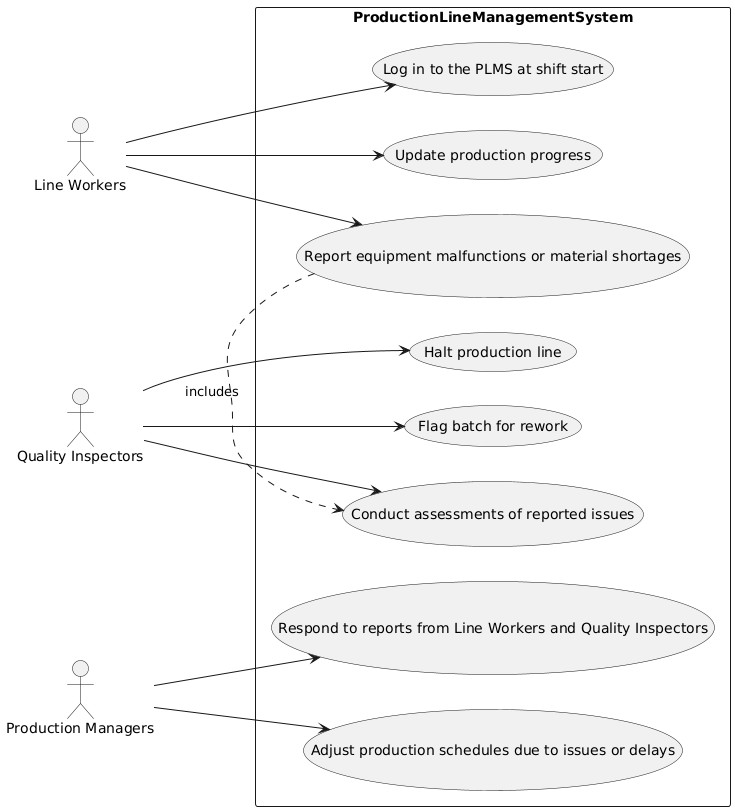

# Use Case Details
**Participant 1, [Requirements a](../../../requirements-a.md)**

## Login
| Name | Login |
|------|---------------------|
| Description | Line workers log in to the PLMS at shift start. |
| Actors | Line Workers |
| Steps | <ol><li>Enter login credentials</li><li>Access production line management system</li></ol> |

## UpdateProgress
| Name | UpdateProgress |
|------|---------------------|
| Description | Line workers update their progress in the PLMS. |
| Actors | Line Workers |
| Steps | <ol><li>Input current production status</li><li>Submit updates to PLMS</li></ol> |

## ReportIssues
| Name | ReportIssues |
|------|---------------------|
| Description | Line workers report equipment malfunctions or material shortages. |
| Actors | Line Workers |
| Steps | <ol><li>Identify issue</li><li>Fill out report form</li><li>Submit report to quality inspectors or production managers</li></ol> |

## ConductAssessments
| Name | ConductAssessments |
|------|---------------------|
| Description | Quality inspectors conduct assessments of reported issues. |
| Actors | Quality Inspectors |
| Steps | <ol><li>Review report</li><li>Investigate issue</li><li>Determine necessary actions</li></ol> |

## HaltProduction
| Name | HaltProduction |
|------|---------------------|
| Description | Quality inspectors halt production line if necessary. |
| Actors | Quality Inspectors |
| Steps | <ol><li>Stop production line</li><li>Notify production managers and line workers</li></ol> |

## FlagRework
| Name | FlagRework |
|------|---------------------|
| Description | Quality inspectors flag batch for rework if necessary. |
| Actors | Quality Inspectors |
| Steps | <ol><li>Identify defective products</li><li>Mark products for rework</li><li>Notify production managers and line workers</li></ol> |

## RespondReports
| Name | RespondReports |
|------|---------------------|
| Description | Production managers respond to reports from Line Workers and Quality Inspectors. |
| Actors | Production Managers |
| Steps | <ol><li>Review report</li><li>Determine necessary actions</li><li>Communicate with line workers and quality inspectors</li></ol> |

## AdjustSchedules
| Name | AdjustSchedules |
|------|---------------------|
| Description | Production managers adjust production schedules due to issues or delays. |
| Actors | Production Managers |
| Steps | <ol><li>Assess impact of issue or delay</li><li>Revise production schedule</li><li>Notify line workers and quality inspectors</li></ol> |