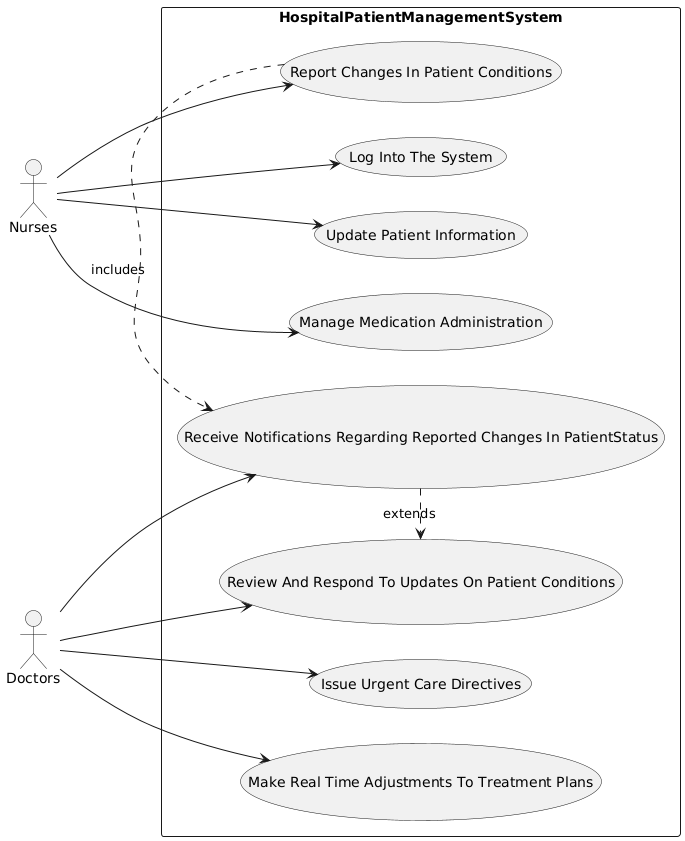

# Use Case Details
**Participant 2, [Requirements b](../../../requirements-b.md)**

## LogIntoTheSystem
| Name | LogIntoTheSystem |
|------|---------------------|
| Description | Nurses log into the system to access patient records at the start of each shift. |
| Actors | Nurses |
| Steps | <ol><li>Enter login credentials</li><li>Access patient records</li></ol> |

## UpdatePatientInformation
| Name | UpdatePatientInformation |
|------|---------------------|
| Description | Nurses update patient information in real-time. |
| Actors | Nurses |
| Steps | <ol><li>Access patient record</li><li>Update patient information</li></ol> |

## ReportChangesInPatientConditions
| Name | ReportChangesInPatientConditions |
|------|---------------------|
| Description | Nurses report changes in patient conditions, triggering notifications to doctors. |
| Actors | Nurses |
| Steps | <ol><li>Identify change in patient condition</li><li>Report change through the system</li></ol> |

## ManageMedicationAdministration
| Name | ManageMedicationAdministration |
|------|---------------------|
| Description | Nurses manage medication administration for patients. |
| Actors | Nurses |
| Steps | <ol><li>Access patient record</li><li>Administer medication</li></ol> |

## ReceiveNotificationsRegardingReportedChangesInPatientStatus
| Name | ReceiveNotificationsRegardingReportedChangesInPatientStatus |
|------|---------------------|
| Description | Doctors receive notifications regarding reported changes in patient status. |
| Actors | Doctors |
| Steps | <ol><li>Receive notification</li><li>Review change in patient condition</li></ol> |

## ReviewAndRespondToUpdatesOnPatientConditions
| Name | ReviewAndRespondToUpdatesOnPatientConditions |
|------|---------------------|
| Description | Doctors review and respond to updates on patient conditions. |
| Actors | Doctors |
| Steps | <ol><li>Review update on patient condition</li><li>Respond with new directives or adjustments</li></ol> |

## IssueUrgentCareDirectives
| Name | IssueUrgentCareDirectives |
|------|---------------------|
| Description | Doctors issue urgent care directives in response to changes in patient conditions. |
| Actors | Doctors |
| Steps | <ol><li>Identify need for urgent care</li><li>Issue directive through the system</li></ol> |

## MakeRealTimeAdjustmentsToTreatmentPlans
| Name | MakeRealTimeAdjustmentsToTreatmentPlans |
|------|---------------------|
| Description | Doctors make real-time adjustments to treatment plans based on updates on patient conditions. |
| Actors | Doctors |
| Steps | <ol><li>Review update on patient condition</li><li>Make adjustment to treatment plan</li></ol> |