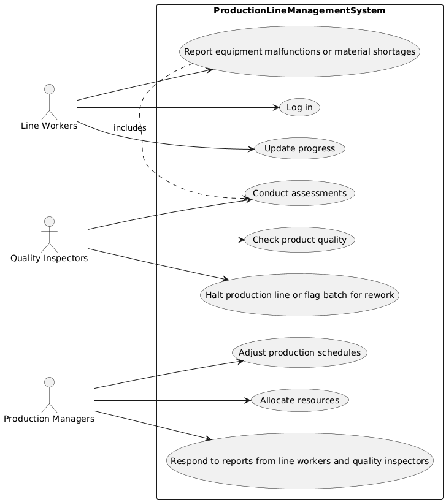

# Use Case Details
**Participant 3, [Requirements a](../../../requirements-a.md)**

## LogIn
| Name | LogIn |
|------|---------------------|
| Description | Line workers log into the Production Line Management System at the beginning of each shift. |
| Actors | Line Workers |
| Steps | <ol><li>Enter username and password</li><li>Authenticate user</li></ol> |

## UpdateProgress
| Name | UpdateProgress |
|------|---------------------|
| Description | Line workers update their progress in the system during production. |
| Actors | Line Workers |
| Steps | <ol><li>Select task to update</li><li>Enter updated progress information</li></ol> |

## ReportIssues
| Name | ReportIssues |
|------|---------------------|
| Description | Line workers report equipment malfunctions or material shortages to quality inspectors or production managers. |
| Actors | Line Workers |
| Steps | <ol><li>Identify issue type</li><li>Enter detailed description of issue</li></ol> |

## CheckQuality
| Name | CheckQuality |
|------|---------------------|
| Description | Quality inspectors check product quality at various stages of production based on established quality criteria. |
| Actors | Quality Inspectors |
| Steps | <ol><li>Inspect products</li><li>Compare with quality standards</li></ol> |

## ConductAssessments
| Name | ConductAssessments |
|------|---------------------|
| Description | Quality inspectors conduct assessments to ensure machines operate within quality standards in response to reported issues. |
| Actors | Quality Inspectors |
| Steps | <ol><li>Investigate issue cause</li><li>Evaluate machine performance</li></ol> |

## HaltProduction
| Name | HaltProduction |
|------|---------------------|
| Description | Quality inspectors halt the production line or flag batches for rework if products do not meet quality standards. |
| Actors | Quality Inspectors |
| Steps | <ol><li>Stop production line</li><li>Tag batch for rework</li></ol> |

## AdjustSchedules
| Name | AdjustSchedules |
|------|---------------------|
| Description | Production managers adjust production schedules due to issues or delays reported by line workers and quality inspectors. |
| Actors | Production Managers |
| Steps | <ol><li>Review schedule impact</li><li>Update production timeline</li></ol> |

## AllocateResources
| Name | AllocateResources |
|------|---------------------|
| Description | Production managers allocate resources as needed in response to reports from line workers and quality inspectors. |
| Actors | Production Managers |
| Steps | <ol><li>Assess resource availability</li><li>Assign resources to tasks</li></ol> |

## RespondReports
| Name | RespondReports |
|------|---------------------|
| Description | Production managers respond to reports from line workers and quality inspectors regarding production issues or concerns. |
| Actors | Production Managers |
| Steps | <ol><li>Review report details</li><li>Determine response action</li></ol> |