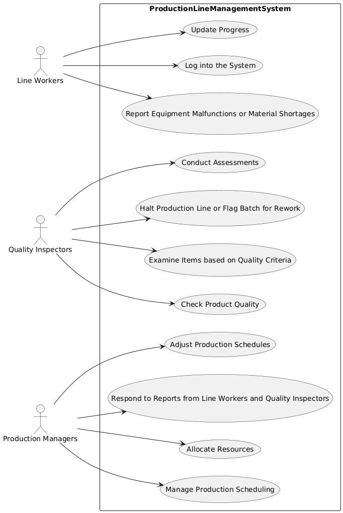

# Use Case Details
**Participant 4, [Requirements a](../../../requirements-a.md)**

## Log into the System
| Name | Log into the System |
|------|---------------------|
| Description | Line workers log into the Production Line Management System at the beginning of each shift. |
| Actors | Line Workers |
| Steps | <ol><li>Enter credentials</li><li>Access system</li></ol> |

## Update Progress
| Name | Update Progress |
|------|---------------------|
| Description | Line workers update their progress in the Production Line Management System. |
| Actors | Line Workers |
| Steps | <ol><li>Select task</li><li>Enter progress</li><li>Submit update</li></ol> |

## Report Equipment Malfunctions or Material Shortages
| Name | Report Equipment Malfunctions or Material Shortages |
|------|---------------------|
| Description | Line workers report equipment malfunctions or material shortages to Quality Inspectors or Production Managers. |
| Actors | Line Workers, Quality Inspectors, Production Managers |
| Steps | <ol><li>Select issue type</li><li>Enter details</li><li>Submit report</li></ol> |

## Check Product Quality
| Name | Check Product Quality |
|------|---------------------|
| Description | Quality Inspectors check product quality at various stages of production. |
| Actors | Quality Inspectors |
| Steps | <ol><li>Inspect product</li><li>Record results</li><li>Take corrective action if necessary</li></ol> |

## Examine Items based on Quality Criteria
| Name | Examine Items based on Quality Criteria |
|------|---------------------|
| Description | Quality Inspectors examine items based on established quality criteria. |
| Actors | Quality Inspectors |
| Steps | <ol><li>Select item</li><li>Evaluate against criteria</li><li>Record results</li></ol> |

## Halt Production Line or Flag Batch for Rework
| Name | Halt Production Line or Flag Batch for Rework |
|------|---------------------|
| Description | Quality Inspectors halt the production line or flag a batch for rework if an item does not meet quality standards. |
| Actors | Quality Inspectors |
| Steps | <ol><li>Identify issue</li><li>Take corrective action</li><li>Notify Production Managers</li></ol> |

## Conduct Assessments
| Name | Conduct Assessments |
|------|---------------------|
| Description | Quality Inspectors conduct assessments to ensure machines operate within quality standards. |
| Actors | Quality Inspectors |
| Steps | <ol><li>Evaluate machine performance</li><li>Record results</li><li>Take corrective action if necessary</li></ol> |

## Manage Production Scheduling
| Name | Manage Production Scheduling |
|------|---------------------|
| Description | Production Managers manage production scheduling and allocate resources as needed. |
| Actors | Production Managers |
| Steps | <ol><li>Review schedule</li><li>Allocate resources</li><li>Adjust schedule as needed</li></ol> |

## Allocate Resources
| Name | Allocate Resources |
|------|---------------------|
| Description | Production Managers allocate resources to support production activities. |
| Actors | Production Managers |
| Steps | <ol><li>Identify resource needs</li><li>Assign resources</li><li>Monitor usage</li></ol> |

## Respond to Reports from Line Workers and Quality Inspectors
| Name | Respond to Reports from Line Workers and Quality Inspectors |
|------|---------------------|
| Description | Production Managers respond to reports from line workers and quality inspectors. |
| Actors | Production Managers, Line Workers, Quality Inspectors |
| Steps | <ol><li>Review report</li><li>Take corrective action</li><li>Notify relevant parties</li></ol> |

## Adjust Production Schedules
| Name | Adjust Production Schedules |
|------|---------------------|
| Description | Production Managers adjust production schedules due to issues or delays. |
| Actors | Production Managers |
| Steps | <ol><li>Evaluate impact of issue</li><li>Adjust schedule</li><li>Notify affected parties</li></ol> |