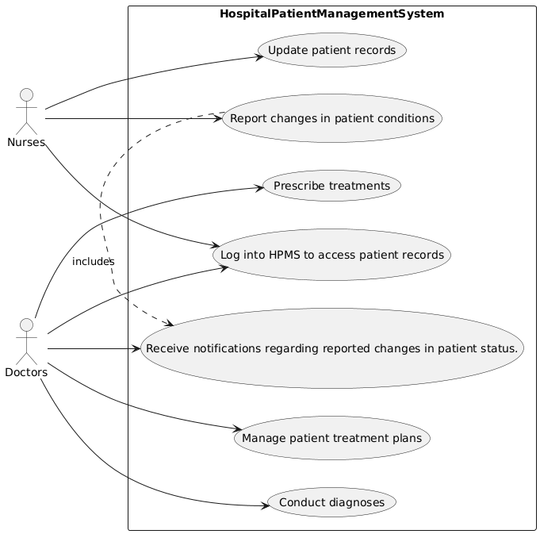

# Use Case Details
**Participant 5, [Requirements b](../../../requirements-b.md)**

## Log into HPMS to access patient records
| Name | Log into HPMS to access patient records |
|------|---------------------|
| Description | Nurses log into the Hospital Patient Management System (HPMS) to access and update patient records. |
| Actors | Nurses |
| Steps | <ol><li>Enter login credentials</li><li>Access patient records</li></ol> |

## Update patient records
| Name | Update patient records |
|------|---------------------|
| Description | Nurses update patient records with new information, such as medication administration or changes in vital signs. |
| Actors | Nurses |
| Steps | <ol><li>Access patient record</li><li>Enter updated information</li><li>Save changes</li></ol> |

## Report changes in patient conditions
| Name | Report changes in patient conditions |
|------|---------------------|
| Description | Nurses report any changes in patient conditions, such as a change in medication or a new symptom. |
| Actors | Nurses |
| Steps | <ol><li>Access patient record</li><li>Enter updated information</li><li>Submit report</li></ol> |

## Manage patient treatment plans
| Name | Manage patient treatment plans |
|------|---------------------|
| Description | Doctors manage patient treatment plans, including updating diagnoses and prescribing treatments. |
| Actors | Doctors |
| Steps | <ol><li>Access patient record</li><li>Update treatment plan</li><li>Save changes</li></ol> |

## Conduct diagnoses
| Name | Conduct diagnoses |
|------|---------------------|
| Description | Doctors conduct diagnoses based on patient symptoms and medical history. |
| Actors | Doctors |
| Steps | <ol><li>Access patient record</li><li>Review medical history</li><li>Conduct diagnosis</li></ol> |

## Prescribe treatments
| Name | Prescribe treatments |
|------|---------------------|
| Description | Doctors prescribe treatments, including medication or therapy, based on diagnosis. |
| Actors | Doctors |
| Steps | <ol><li>Access patient record</li><li>Prescribe treatment</li><li>Save changes</li></ol> |

## Receive notifications regarding reported changes in patient status.
| Name | Receive notifications regarding reported changes in patient status. |
|------|---------------------|
| Description | Doctors receive notifications when nurses report changes in patient conditions, allowing them to respond swiftly. |
| Actors | Doctors |
| Steps | <ol><li>Receive notification</li><li>Access patient record</li><li>Respond to change</li></ol> |